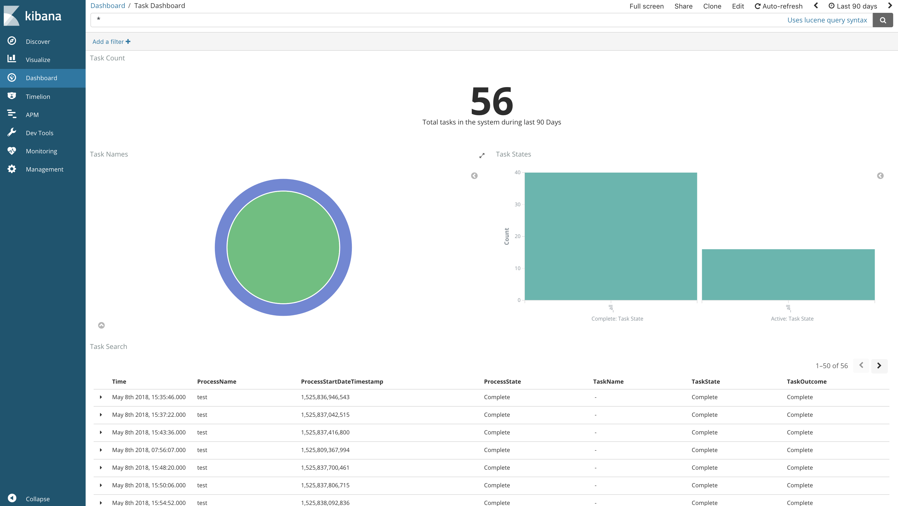

# activiti-analytics-spring-boot

Please find below the solution diagram. The source of the diagram created using [sequencediagram.org](https://sequencediagram.org) can be found [here](https://goo.gl/6eKwvb)

Activiti must be running with both history and events turned on to have analytics data

* Change the application.properties to match your activiti installation
* Currently tested only against Activiti running on H2, Oracle, MySQL or Postgres databases. 
* If you are using Oracle DB, do the following to include oracle jdbc driver
Download the Oracle jdbc driver and run the following commands to add driver to your local maven repository and aasociated pom.xml entry.

	`
	mvn install:install-file -DgroupId=<groupId> -DartifactId=<artifactId> -Dversion=<version> -Dpackaging=jar -Dfile=<jar-file-name and location> -DgeneratePom=true
	`
	
	`
	mvn install:install-file -DgroupId=com.oracle.jdbc -DartifactId=ojdbc8 -Dversion=12.2.0.1 -Dpackaging=jar -Dfile=ojdbc8.jar -DgeneratePom=true
	`

	`
	<dependency>
		<groupId>com.oracle.jdbc</groupId>
		<artifactId>ojdbc8</artifactId>
		<version>12.2.0.1</version>
	</dependency>
	`

* Run using the following command 
	
	`
	mvn clean spring-boot:run 
	`
	
* Running using the packaged jar
	
	`
	mvn clean package
	`

	`
	java -jar target/activiti-analytics-spring-boot-1.0.0-SNAPSHOT.jar
	`
* Run using docker (run command is just an example, adjust as per your env)
 
 	`
 	mvn clean package
 	`

	`
	docker build -t activiti-analytics-spring-boot .
	`
	
	`
	docker run --name aps-analytics -v /tmp/activiti-analytics-spring-boot/confs:/conf --rm  --net mydockernetwork  activiti-analytics-spring-boot
	`
	
* Prerequisite - Elasticsearch must be started prior to starting this app. Easiest way is to get it up and running is using Elastic docker.

	`
	docker run --name elasticsearch -p 9200:9200 -e "http.host=0.0.0.0" -e "transport.host=127.0.0.1" -e "xpack.security.enabled=false" --net mydockernetwork 	docker.elastic.co/elasticsearch/elasticsearch:6.2.4
	`

# Set up some sample visualizations.
* Easiest way to start an instance of Kibana is using docker!

`
docker run --name kibana-6.2.4 --net mydockernetwork  -e XPACK_SECURITY_ENABLED=false -p 5601:5601 docker.elastic.co/kibana/kibana:6.2.4
`
* Once you have Kibana running open http://localhost:5601/ (default host and port of Kibana unless you changed it) in your browser.

* **Run few processes in APS to make sure we have some data in Elasticsearch to create some dashboards. if you miss this step, you won't be able to create the following steps!**

* Create an index pattern "bpmanalyticseventlog-\*" by going to Management -> Index Patterns -> Create index pattern -> bpmanalyticseventlog-\* -> Select "ProcessStartDate" as the Time Filter field

### Import sample dashboard and visualizations
1.	Import a task search object using the JSON file "task-search-kibana.json" present in kibana folder. Management -> Saved Objects -> Searches -> Import -> task-search-kibana.json
2.	After importing the task search, import the visualizations and dashboard built on top of the imported search using the file "task-dashboard-kibana.json". Management -> Saved Objects -> Searches -> Import ->-> task-dashboard-kibana.json
3.	Once you have done the above two steps, you now should have a task dashboard in your kibana as shown below

Similarly you can create more task/process dashboards and visualizations in Kibana!! It is now your turn to explore more!!
